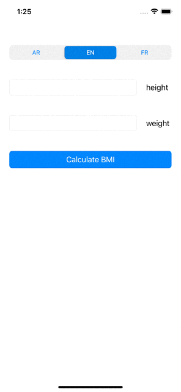

# BMI-Calculator

- A simple BMI calculator built with swift 5 utilizing Internationalization and Localization.

## Fetures 

- support for arabic, english and french languages
- support number format based on the locale (e.g. "." for english, arabic and "," for french)

## UIKIT Elements
- UISegmentedControl
- UIButton
- UITextField
- UILabel

## Demo

